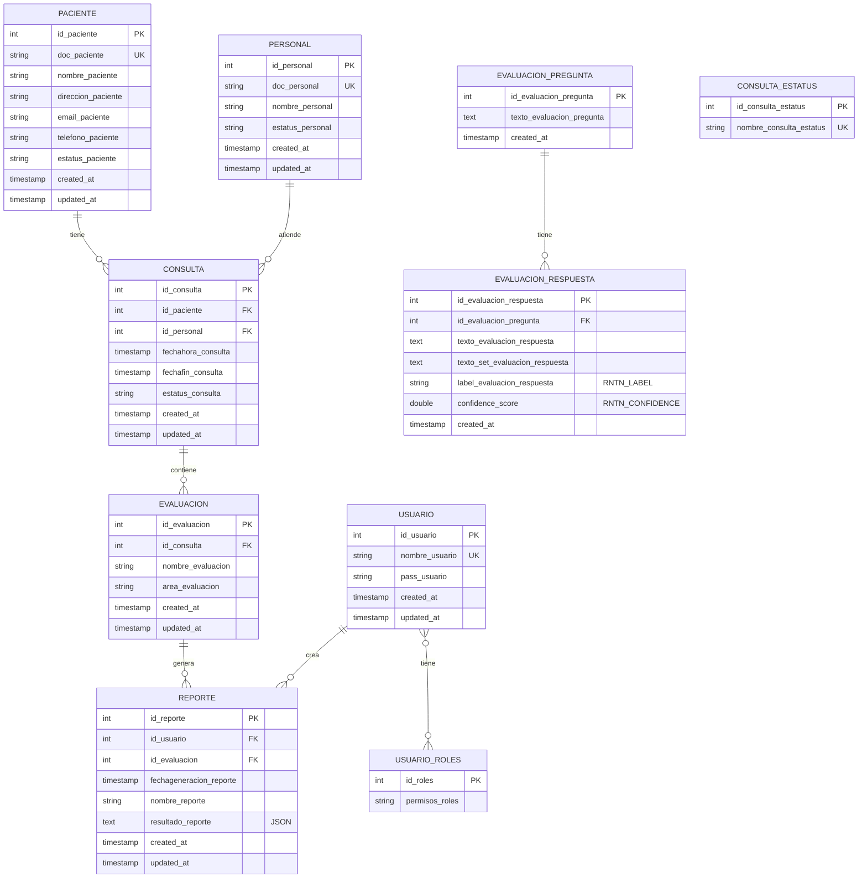
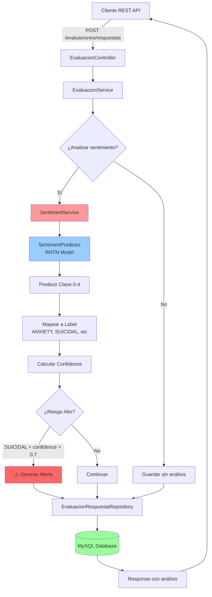
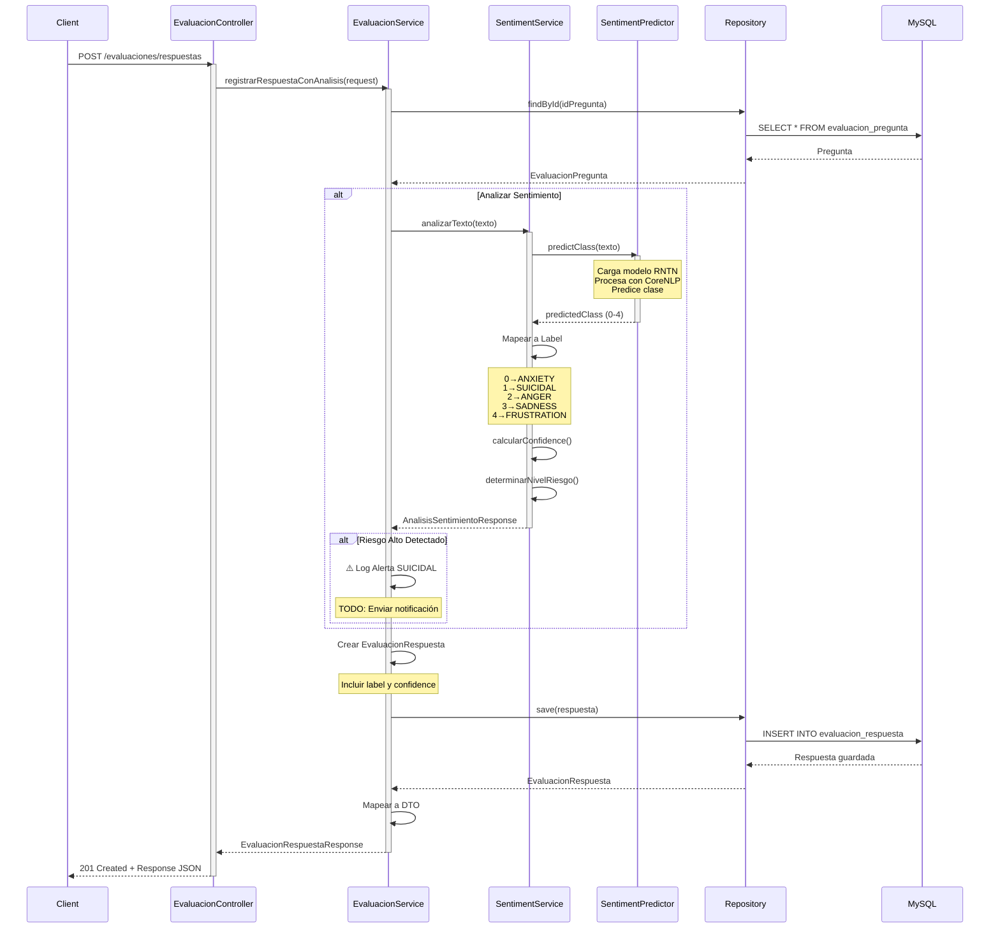
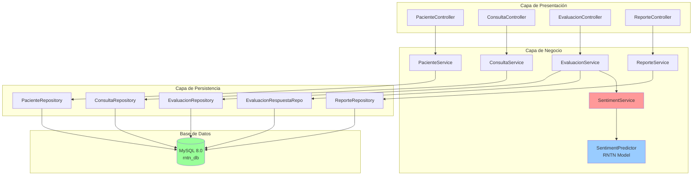
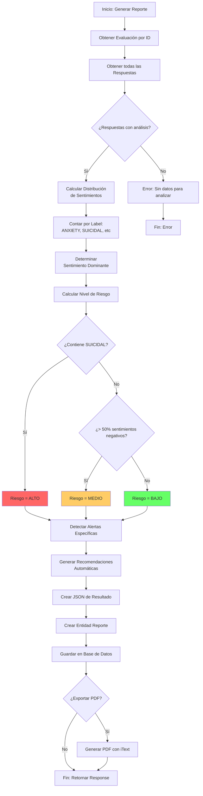
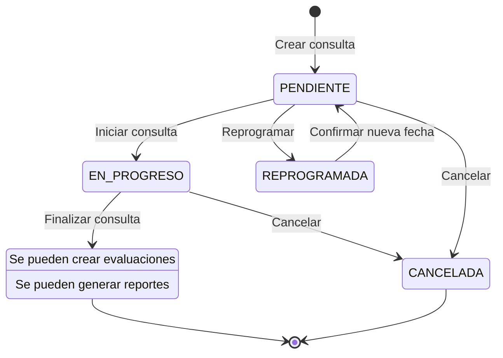

# Diagrama Entidad-Relación - RNTN Sentiment API

Este documento contiene el diagrama ER completo del sistema en formato Mermaid para visualización en GitHub y otras plataformas compatibles.

---

## Diagrama ER Completo



---

## Diagrama de Flujo: Análisis de Sentimiento



---

## Diagrama de Secuencia: Registro de Respuesta con Análisis



---

## Diagrama de Componentes: Arquitectura por Capas



---

## Diagrama de Actividades: Generación de Reporte



---

## Diagrama de Estados: Consulta



---

## Relaciones y Cardinalidades

| Relación | Cardinalidad | Descripción |
|----------|--------------|-------------|
| **PACIENTE ← CONSULTA** | 1:N | Un paciente puede tener múltiples consultas |
| **PERSONAL ← CONSULTA** | 1:N | Un personal atiende múltiples consultas |
| **CONSULTA ← EVALUACION** | 1:N | Una consulta puede tener múltiples evaluaciones |
| **EVALUACION_PREGUNTA ← EVALUACION_RESPUESTA** | 1:N | Una pregunta tiene múltiples respuestas |
| **EVALUACION ← REPORTE** | 1:N | Una evaluación puede generar múltiples reportes |
| **USUARIO ← REPORTE** | 1:N | Un usuario crea múltiples reportes |
| **USUARIO ↔ USUARIO_ROLES** | N:M | Relación muchos a muchos (tabla intermedia) |

---

## Índices Importantes

```sql
-- Performance crítica
CREATE INDEX idx_consulta_paciente_estatus ON consulta(id_paciente, estatus_consulta);
CREATE INDEX idx_respuesta_label_confidence ON evaluacion_respuesta(label_evaluacion_respuesta, confidence_score);

-- Búsquedas frecuentes
CREATE INDEX idx_consulta_personal_fecha ON consulta(id_personal, fechahora_consulta);
CREATE INDEX idx_reporte_usuario_fecha ON reporte(id_usuario, fechageneracion_reporte);

-- Fulltext search
CREATE FULLTEXT INDEX idx_fulltext_respuesta ON evaluacion_respuesta(texto_evaluacion_respuesta);
```

---

## Vistas Útiles (Opcional)

### Vista: Distribución de Sentimientos por Paciente

```sql
CREATE VIEW v_sentimientos_paciente AS
SELECT 
    p.id_paciente,
    p.nombre_paciente,
    er.label_evaluacion_respuesta,
    COUNT(*) as total,
    AVG(er.confidence_score) as confianza_promedio
FROM paciente p
JOIN consulta c ON p.id_paciente = c.id_paciente
JOIN evaluacion e ON c.id_consulta = e.id_consulta
-- Aquí se necesitaría una tabla de relación evaluacion_respuesta -> evaluacion
GROUP BY p.id_paciente, p.nombre_paciente, er.label_evaluacion_respuesta;
```

### Vista: Alertas de Riesgo Alto

```sql
CREATE VIEW v_alertas_riesgo_alto AS
SELECT 
    p.id_paciente,
    p.nombre_paciente,
    p.telefono_paciente,
    c.id_consulta,
    c.fechahora_consulta,
    per.nombre_personal,
    er.texto_evaluacion_respuesta,
    er.label_evaluacion_respuesta,
    er.confidence_score
FROM evaluacion_respuesta er
JOIN evaluacion_pregunta ep ON er.id_evaluacion_pregunta = ep.id_evaluacion_pregunta
-- Relaciones a completar según modelo final
WHERE er.label_evaluacion_respuesta = 'SUICIDAL'
    AND er.confidence_score > 0.7
ORDER BY er.confidence_score DESC, c.fechahora_consulta DESC;
```

---

## Triggers Útiles (Opcional)

### Trigger: Notificar Riesgo Alto

```sql
DELIMITER $$

CREATE TRIGGER trg_alerta_riesgo_suicida
AFTER INSERT ON evaluacion_respuesta
FOR EACH ROW
BEGIN
    IF NEW.label_evaluacion_respuesta = 'SUICIDAL' AND NEW.confidence_score > 0.7 THEN
        -- Insertar en tabla de alertas
        INSERT INTO alertas (tipo, nivel, id_respuesta, fecha_alerta)
        VALUES ('RIESGO_SUICIDA', 'ALTO', NEW.id_evaluacion_respuesta, NOW());
        
        -- TODO: Llamar procedimiento de notificación externa
    END IF;
END$$

DELIMITER ;
```

---

## Stored Procedures Útiles (Opcional)

### Procedimiento: Obtener Dashboard de Consulta

```sql
DELIMITER $$

CREATE PROCEDURE sp_dashboard_consulta(IN p_id_consulta INT)
BEGIN
    -- Información básica de consulta
    SELECT 
        c.id_consulta,
        p.nombre_paciente,
        per.nombre_personal,
        c.fechahora_consulta,
        c.estatus_consulta
    FROM consulta c
    JOIN paciente p ON c.id_paciente = p.id_paciente
    JOIN personal per ON c.id_personal = per.id_personal
    WHERE c.id_consulta = p_id_consulta;
    
    -- Distribución de sentimientos
    -- (Query a completar según relaciones finales)
    
    -- Alertas activas
    -- (Query a completar)
END$$

DELIMITER ;
```

---

## Formato JSON del campo `resultado_reporte`

Ejemplo de estructura JSON almacenada en `reporte.resultado_reporte`:

```json
{
  "paciente": "Juan Pérez",
  "fecha": "2025-12-21",
  "evaluacion": "Evaluación Inicial",
  "totalRespuestas": 10,
  "sentimientoDominante": "ANXIETY",
  "distribucion": {
    "ANXIETY": 3,
    "SUICIDAL": 1,
    "ANGER": 2,
    "SADNESS": 3,
    "FRUSTRATION": 1
  },
  "nivelRiesgo": "ALTO",
  "alertas": [
    {
      "tipo": "RIESGO_SUICIDA",
      "severidad": "ALTA",
      "respuesta": "A veces pienso que no tiene sentido seguir",
      "confidence": 0.87
    }
  ],
  "recomendaciones": [
    "⚠️ URGENTE: Contactar inmediatamente con el paciente",
    "Programar seguimiento diario",
    "Considerar derivación a psiquiatría de urgencia"
  ],
  "estadisticas": {
    "confidencePromedio": 0.84,
    "respuestasAnalizadas": 10,
    "respuestasSinAnalisis": 0
  }
}
```

---

## Visualización del Modelo en Herramientas

### MySQL Workbench
1. Abrir MySQL Workbench
2. Database → Reverse Engineer
3. Seleccionar base de datos `rntn_db`
4. Generar diagrama ER automáticamente

### DBeaver
1. Conectar a base de datos
2. Click derecho en `rntn_db` → ER Diagram
3. Ver diagrama interactivo

### dbdiagram.io
Importar el siguiente código DBML:

```dbml
Table paciente {
  id_paciente int [pk, increment]
  doc_paciente varchar(20) [unique, not null]
  nombre_paciente varchar(100) [not null]
  direccion_paciente varchar(255)
  email_paciente varchar(100)
  telefono_paciente varchar(20)
  estatus_paciente varchar(20) [default: 'ACTIVO']
  created_at timestamp
  updated_at timestamp
}

Table personal {
  id_personal int [pk, increment]
  doc_personal varchar(20) [unique, not null]
  nombre_personal varchar(100) [not null]
  estatus_personal varchar(20)
  created_at timestamp
  updated_at timestamp
}

Table consulta {
  id_consulta int [pk, increment]
  id_paciente int [ref: > paciente.id_paciente]
  id_personal int [ref: > personal.id_personal]
  fechahora_consulta timestamp
  fechafin_consulta timestamp
  estatus_consulta varchar(50)
  created_at timestamp
  updated_at timestamp
}

Table evaluacion {
  id_evaluacion int [pk, increment]
  id_consulta int [ref: > consulta.id_consulta]
  nombre_evaluacion varchar(100)
  area_evaluacion varchar(100)
  created_at timestamp
  updated_at timestamp
}

Table evaluacion_respuesta {
  id_evaluacion_respuesta int [pk, increment]
  id_evaluacion_pregunta int
  texto_evaluacion_respuesta text
  label_evaluacion_respuesta varchar(50) [note: 'RNTN Label']
  confidence_score double [note: 'RNTN Confidence']
  created_at timestamp
}
```

---

**Documento generado el 21 de Diciembre de 2025**  
**Versión: 1.0 - Diagramas Completos**

